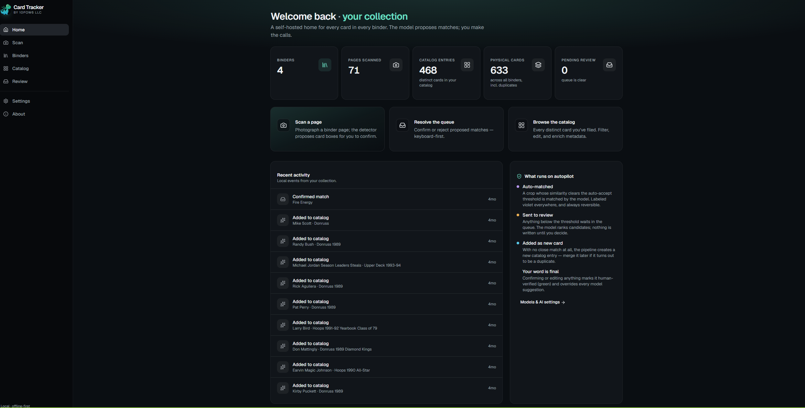
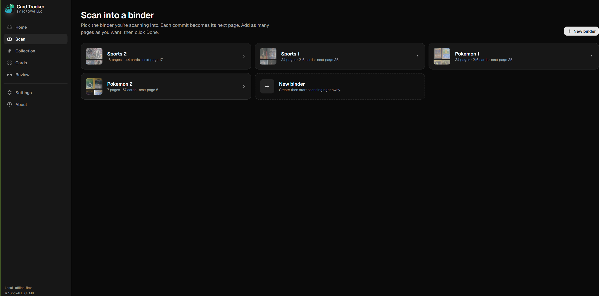
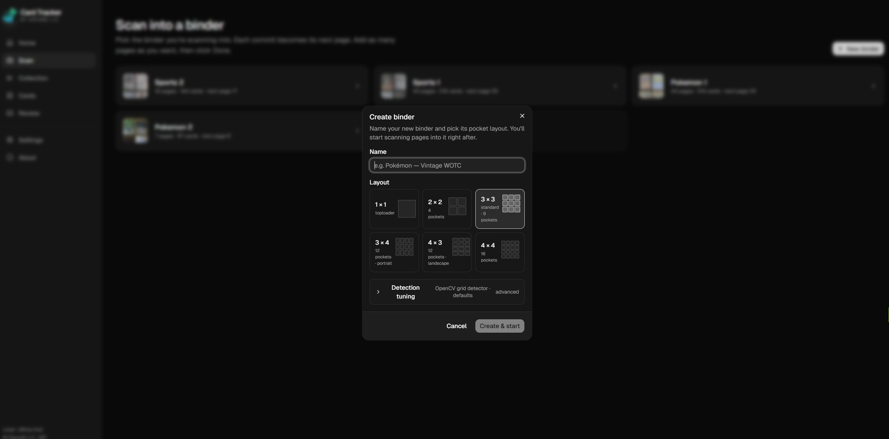
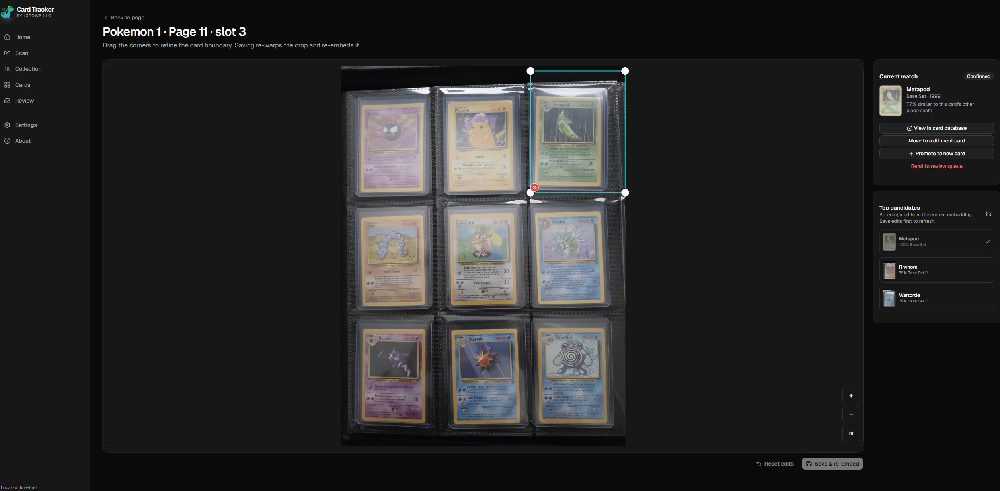
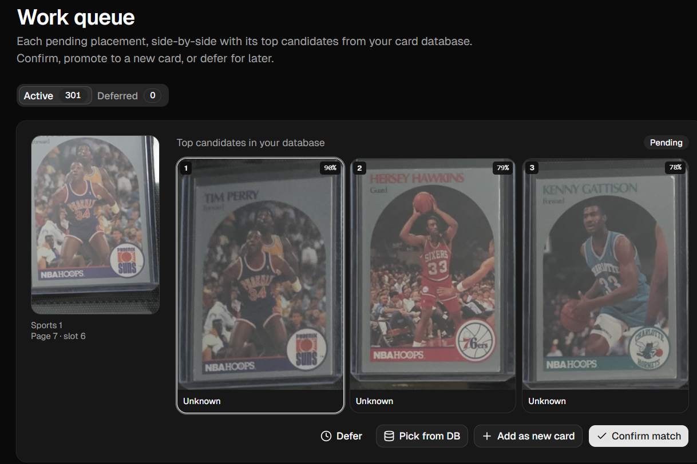
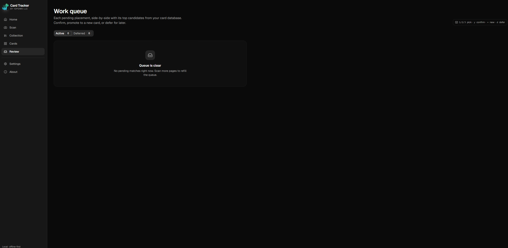
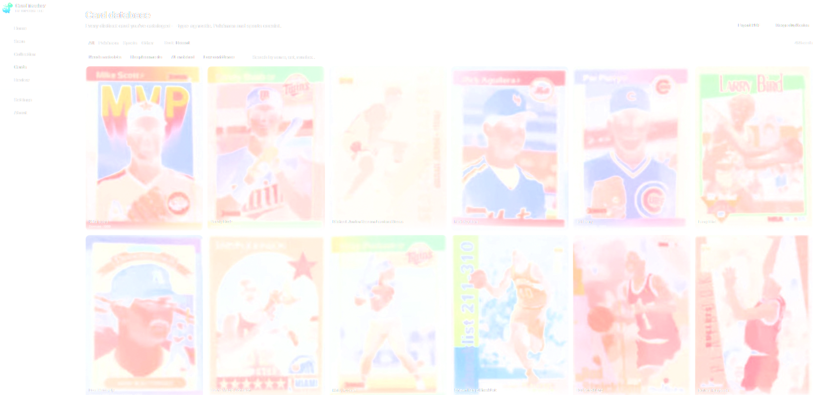
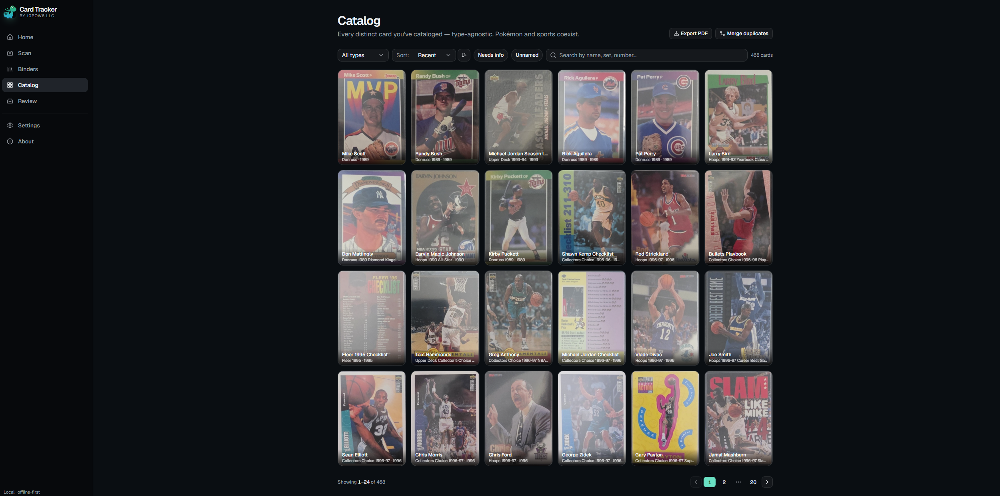
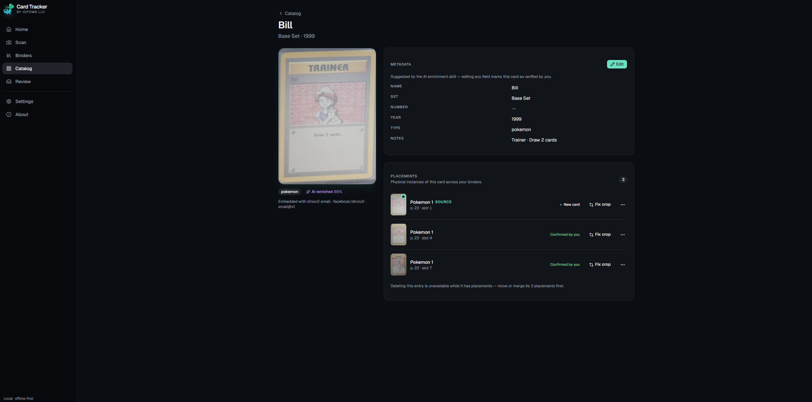
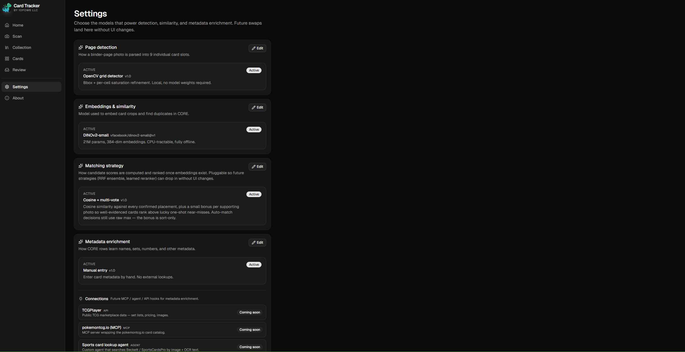

<div align="center">


# Card Tracker

**Self-hosted, offline-first inventory for binder-stored trading cards.**

Photograph a binder page → the app finds each card, indexes its physical location, and keeps a database of every unique card you own. Pokémon, sports, MTG, Yu-Gi-Oh — same database, same flow.

</div>

---

## Support

If Card Tracker saves you a few "where did I put my Charizard?" hours and you'd like to chip in, **pay-what-you-want via Stripe**: <https://buy.stripe.com/cN2dUh9Jw0b1eo8000>. Entirely optional — the project is and stays MIT-licensed and self-hostable for free.

## The problem

If you store cards in binders, every "where did I put my Charizard?" devolves into flipping pages. Existing solutions either:

- Make you enter every card by hand (tedious for hundreds of cards).
- Charge a subscription.
- Rely on cloud APIs to identify cards (privacy + dependency on someone else's server).
- Lock you into one card type (Pokémon-only, sports-only).

**Card Tracker is type-agnostic, fully self-hosted, and offline by default.** Point your phone camera at a binder page; the app parses each pocket and tracks every card back to its physical location (binder → page → slot). The only network call in normal use is a one-time download of the local vision model on first run.



## How it works

1. **Capture.** Photograph or upload a binder page in any layout from 1×1 (toploader) up to 4×4 (16 pockets).
2. **Detect.** OpenCV finds the binder page in the photo, splits it into card-shaped slots, and pre-fills polygon boxes around each card.
3. **Adjust.** You drag corners to fix any boxes the detector missed, or mark slots as deliberately empty.
4. **Embed & match.** Each card crop is run through DINOv2-small (a 21M-parameter local vision model) and compared by cosine similarity against your existing card database.
5. **Resolve.** Strong matches link automatically. Ambiguous ones land in a work queue for a quick yes/no review. Cards with no near-neighbor become brand-new database entries.

Every step runs locally on your machine. No accounts, no cloud, no per-card API quotas.

### Scan into a binder

Pick the binder you're scanning into, or spin up a new one — name it, choose a layout, optionally tweak detection parameters, and start firing pages at it.





### Adjust the detector's boxes

OpenCV pre-fills a polygon around each card; you drag corners to fix any it missed and mark deliberately-empty pockets. The right-rail shows the current match plus the top-3 candidates from your database — confirm, move, promote, or send to the review queue without leaving the page.



### Resolve ambiguous matches

Anything the embedder isn't confident about lands in the **Work queue**: each pending placement side-by-side with its top candidates. Keyboard shortcuts (`1/2/3` pick, `y` confirm, `+` new card, `d` defer) make it fast.





### Browse your collection

Three lenses on the same data:

- **Card database** — every distinct CORE row, filterable by type and metadata state. Export the whole thing to a printable, Discord-shareable PDF in one click.
- **Collection** — every physical card across every binder, duplicates included; click through to inspect or refine the placement.
- **Binders** — drill into a binder, see each page as a populated grid, export a per-page PDF for sharing.






### Enrich metadata locally with Claude Code

Each card has editable metadata (name, set, year, type, notes). For unenriched cards you can run the bundled **Claude Code skill** locally: it pulls a batch via the API, identifies each card from its representative crop, optionally web-searches an allowlisted source you control, and posts back suggestions. Card numbers are only accepted at ≥95% confidence, and manual edits override and clear the AI flag. Nothing leaves your machine without your domain allowlist permitting it.





## Features

- 📦 **Physical-location tracking** — binders → pages → slots, every placement linked to a canonical card identity.
- 🔍 **Visual similarity search** — DINOv2-small embeddings, brute-force cosine sim. Comfortable into the tens of thousands of cards.
- 📐 **Configurable layouts** — 1×1, 2×2, 3×3 (default), 3×4, 4×3, 4×4. Per-binder.
- 📱 **Mobile-first capture** — phone goes straight to the camera (Android) or "Take Photo" sheet (iOS).
- ✅ **Human-in-the-loop review queue** — keyboard shortcuts, defer/un-defer for ambiguous matches.
- 🛠️ **Placement repair tools** — refine polygons, move cards between identities, promote to new, send back to review.
- ✏️ **Editable metadata** — manual edit-in-place, plus an opt-in Claude Code skill that proposes metadata for unenriched cards using your own allowlisted web sources.
- 📄 **PDF export** — one-click export of your full database, a single binder's cards, or a binder's per-page grid layout. Discord-shareable.
- 🧩 **Pluggable model slots** — swap detection / embedding / metadata-enrichment models in the future without UI changes.
- 🤝 **Forward-looking integrations** — placeholders for MCP servers and external agents to enrich card metadata.
- 🛡️ **Offline-first** — no third-party API keys required. The model weights download once.

## Stack

| Layer | What |
|---|---|
| Backend | Python 3.11+, FastAPI, SQLite, OpenCV, PyTorch + transformers (DINOv2-small) |
| Frontend | Vite, React 19, React Router 8, TypeScript, Tailwind v4, shadcn/ui |
| Storage | Single-file SQLite at `data/card_tracker.db`; crops + scans on disk under `data/` |

## Setup

### Prerequisites

- **Python 3.11+** (3.13 tested).
- **Node 22.22+** (22.x LTS — react-router 8 requires ≥ 22.22.0 at install time).
- **Yarn classic** (v1) — once Node is installed: `npm install --global yarn`.
- **Git**.
- *(Optional)* **Claude Code CLI** — only needed for the [metadata-enrichment skill](docs/enrichment.md): `npm install --global @anthropic-ai/claude-code`, then run `claude` once to sign in.

### Clone

```bash
git clone https://github.com/10pow6/self-hosted-card-tracker.git
cd self-hosted-card-tracker
```

### Backend

#### Linux / macOS

```bash
cd backend
python3 -m venv .venv
source .venv/bin/activate
pip install -e ".[dev]"
python scripts/init_db.py
```

#### Windows (Command Prompt)

```cmd
cd backend
python -m venv .venv
.venv\Scripts\activate.bat
pip install -e ".[dev]"
python scripts\init_db.py
```

#### Windows (PowerShell)

```powershell
cd backend
python -m venv .venv
.venv\Scripts\Activate.ps1
pip install -e ".[dev]"
python scripts/init_db.py
```

> If PowerShell blocks the activation script, run `Set-ExecutionPolicy -Scope CurrentUser -ExecutionPolicy RemoteSigned` once.

### Frontend

In a separate shell, from the repo root:

```bash
cd frontend
yarn install
```

### Run it

Two terminals (backend with venv active):

**Backend**
```bash
uvicorn card_tracker.main:app --reload --port 8000
```

**Frontend**
```bash
yarn dev
```

Open <http://localhost:5173> in your browser.

> The **first scan** triggers a one-time download of the DINOv2-small weights (~90 MB) into `data/models/`. Subsequent scans run fully offline. Override the cache location with the `HF_HOME` environment variable if you prefer.

### Mobile capture

Vite prints multiple LAN URLs when you run `yarn dev`. Open `http://<your-machine-ip>:5173` on your phone, navigate to a binder, and tap **Scan a page**.

- **Android Chrome**: tapping the upload tile opens the camera directly.
- **iOS Safari**: shows a "Take Photo / Photo Library" sheet (iOS UI policy — there is no way to bypass that with a plain `<input type="file">`; the only alternative is a live `getUserMedia` viewfinder, which requires HTTPS).

## Troubleshooting

- **`ETIMEDOUT 127.0.0.1:8000` from the Vite proxy on Windows.** Machines with WSL / Hyper-V / VirtualBox network adapters sometimes can't talk to the literal IPv4 loopback through Node. The bundled `vite.config.ts` already proxies via `localhost`. If it still trips, run uvicorn with `--host 0.0.0.0` so it listens on all interfaces.
- **First scan is slow.** That's the one-time DINOv2 weight download. Once cached under `data/models/` you'll see embeddings complete in ~50 ms per card on CPU.
- **Detection misses cards on dense layouts (4×4).** The default detection thresholds were tuned for 3×3 cell sizes. Lower `min_cell_fill` in the binder's **Advanced detection tuning** panel (create-binder dialog), or just drag the boxes manually before commit — see [docs/detection.md](docs/detection.md).

## Project layout

```
self-hosted-card-tracker/
├── backend/                    FastAPI + SQLite + OpenCV + DINOv2
│   ├── src/card_tracker/
│   │   ├── api/                HTTP endpoints
│   │   ├── services/           Business logic (binders, ingest, review, ...)
│   │   ├── cv/grid.py          Page detection
│   │   ├── embeddings/         DINOv2-small wrapper (lazy singleton)
│   │   ├── db/                 SQLite schema + connection
│   │   └── layouts.py          RxC layout parser/validator
│   └── scripts/init_db.py      Initialize the local database
├── frontend/                   Vite + React 19 + TS + Tailwind + shadcn
│   ├── public/icon.png         App icon (this one)
│   └── src/
│       ├── routes/             Dashboard, Scan, Binders, Cards, Review, Settings
│       ├── components/         Domain + UI components
│       ├── api/                Typed API clients
│       └── lib/layout.ts       Frontend layout helpers
├── data/                       Created on first run (SQLite + crops + scans + models + exports)
├── docs/                       Per-topic reference (architecture, data model, API, …)
└── sample_images/              Test images for the scan flow
```

## Further reading

- [docs/index.md](docs/index.md) — full doc map.
- [docs/architecture.md](docs/architecture.md) — system layers, storage conventions, constraints.
- [docs/data-model.md](docs/data-model.md) — schema and identity rules.
- [docs/api.md](docs/api.md) — every HTTP endpoint.
- [docs/enrichment.md](docs/enrichment.md) — Claude Code metadata-enrichment skill.
- [docs/export.md](docs/export.md) — PDF export formats.
- [docs/setup.md](docs/setup.md) — setup with extra environment notes.

## License

Released under the [MIT License](LICENSE). Copyright © 2026 10pow6 LLC.

> The software is provided **"as is"**, without warranty of any kind, express or implied, including but not limited to the warranties of merchantability, fitness for a particular purpose, and non-infringement. In no event shall the authors or copyright holders be liable for any claim, damages, or other liability arising from the use of the software.

## 10pow6

- GitHub — <https://github.com/10pow6>
- Twitter — <https://twitter.com/10pow6>
- Discord — <https://discord.gg/6tr2kHcJ2b>
- YouTube — <https://www.youtube.com/@10pow6>
